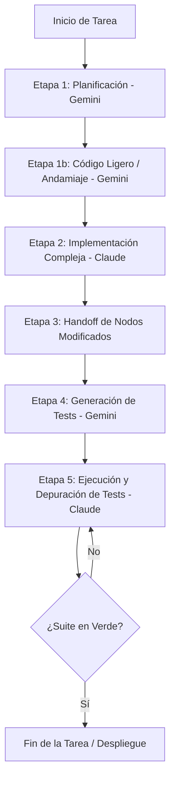

# Informe Comprensivo: Pipeline de Desarrollo Optimizado (Antigravity Pipeline)

Este documento detalla la arquitectura, las herramientas y las reglas del pipeline optimizado diseñado para la interacción entre **Gemini** (agente de planificación y andamiaje) y **Claude** (agente de razonamiento profundo y ejecución de código). El objetivo principal de este pipeline es **minimizar drásticamente el consumo de tokens (ahorros de entre 60% y 95%)** y optimizar la precisión en tareas de desarrollo complejas.

---

## 1. Arquitectura y Flujo de Trabajo Multi-Modelo

El pipeline divide el ciclo de vida del desarrollo en 5 etapas distintas, asignando a cada modelo el rol donde es más costo-eficiente y preciso:

### Detalle de las Etapas
1. **Etapa 1: Planificación (Gemini 3.1 Pro / Deep Think):**
   - Gemini analiza el requerimiento utilizando el grafo del código.
   - Produce un plan de implementación detallado y una lista de archivos impactados.
   - Identifica y marca las secciones complejas que requerirán razonamiento profundo.
2. **Etapa 1b: Andamiaje y Código Ligero (Gemini 3.5 Flash):**
   - Gemini implementa la estructura básica, boilerplate y cambios sencillos de un solo archivo.
   - Si detecta efectos dominó o lógica compleja multi-archivo, se detiene y escala a Claude.
3. **Etapa 2: Implementación Compleja (Claude Opus/Sonnet 4.6):**
   - Claude toma el plan de Gemini y ejecuta las modificaciones complejas en el código, asegurando la consistencia del sistema y resolviendo la lógica de negocio pesada.
4. **Etapa 3: Handoff de Nodos Modificados:**
   - Claude genera un reporte de los nodos/símbolos exactos que editó.
5. **Etapa 4: Generación de Tests (Gemini 3.5 Flash):**
   - Gemini recibe la lista de nodos modificados y genera casos de prueba específicos únicamente para esos nodos (evitando tokens innecesarios de tests globales).
6. **Etapa 5: Ejecución y Depuración de Tests (Claude Sonnet 4.6):**
   - Claude ejecuta la suite de pruebas generada, depura los errores en el código de producción y itera hasta que todas las pruebas pasen (`Verde`).

---

## 2. Tecnologías y Herramientas del Pipeline

El ahorro extremo de tokens se logra mediante la integración de varios pilares tecnológicos complementarios:

### A. Graphify (Exploración Local por Grafo)
* **Qué es:** Una herramienta que genera un grafo de conocimiento local (`graphify-out/`) del codebase analizando el árbol de sintaxis abstracta (AST) mediante Tree-sitter.
* **Cómo ahorra tokens:** En lugar de realizar búsquedas textuales costosas (`grep`) o leer archivos completos para entender las dependencias, los agentes consultan el grafo localmente.
* **Comandos Clave:**
  - `graphify query "..."`: Para entender la relación entre módulos.
  - `graphify path "A" "B"`: Para mapear la ruta de llamadas de una función/clase.
  - `graphify explain "Symbol"`: Para obtener la definición aislada de un símbolo sin leer el archivo completo.

### B. RTK (Rust Token Killer)
* **Qué es:** Un proxy de comandos CLI. Intercepta los comandos de consola que ejecutan los agentes y optimiza el output antes de enviarlo al contexto del LLM.
* **Cómo ahorra tokens:** Elimina metadatos innecesarios, recorta salidas repetitivas y comprime la información de comandos comunes (`git`, `cargo`, `npm`, `ls`, etc.).

### C. Integración de MarkItDown (Microsoft) en RTK
* **Qué es:** Una integración que intercepta el comando `rtk read <file>` (y llamadas a lectura de archivos no estructurados).
* **Cómo ahorra tokens:** Si el archivo tiene extensiones de documento (como `.pdf`, `.docx`, `.xlsx`, `.pptx`, `.html`, `.png`, `.jpg`, `.mp3`, `.wav`), el script wrapper de `rtk` lo procesa automáticamente con `markitdown` para convertirlo en Markdown estructurado y ligero. Si no es un documento (código fuente tradicional), delega el comando directamente al binario original de `rtk read`.
* **Ubicación del Wrapper:** `/Users/feli/.antigravity-ide/antigravity-ide/bin/rtk`

### D. Hooks de Reescritura Automática (`PreToolUse`)
* Integrado en la configuración del agente (como Claude Code), el hook intercepta llamadas a herramientas de visualización crudas (como `cat archivo.pdf`) y las reescribe automáticamente a `rtk read archivo.pdf`, garantizando que la conversión de MarkItDown y la optimización de RTK se apliquen de forma transparente.

### E. Arquitectura Lazy Loading y Aislamiento de Contexto
* **Qué es:** Una disciplina de **carga diferida de herramientas**. El agente ejecutor (Claude) arranca cada tarea con el contexto de herramientas **limpio** y solo carga los skills y servidores MCP que el planificador (Gemini) declaró explícitamente en el campo `[requiere_skills]` de esa tarea.
* **Cómo ahorra tokens:** Evita el *token bloat* de inyectar por adelantado los esquemas de **todas** las herramientas disponibles. Al cargar únicamente lo que la tarea necesita —o nada, si declara `[requiere_skills: Ninguno]`— la ventana de contexto se mantiene mínima y reproducible entre tareas.
* **Cómo funciona el contrato:**
  - **Gemini (Planificador):** divide el plan en tareas discretas y anota en cada una el arreglo `[requiere_skills]` con el alcance cerrado de herramientas permitidas (regla de la Etapa 1 en `GEMINI.md`).
  - **Claude (Ejecutor):** limpia el contexto entre tareas y respeta ese alcance como límite **inquebrantable**; no carga nada fuera de la lista (regla de Aislamiento de Contexto en `CLAUDE.md`).
* **Pilar de ahorro:** Junto con Graphify (exploración por grafo), RTK (proxy CLI) y MarkItDown (conversión de documentos), la carga diferida es el cuarto mecanismo estructural para minimizar tokens — esta vez actuando sobre el **contexto de herramientas**, no sobre la salida de comandos ni la lectura de archivos.

---

## 3. Pruebas Empíricas y Métricas de Ahorro

Se realizaron pruebas de rendimiento comparando el uso de comandos tradicionales (sin optimizar) contra el nuevo pipeline de Antigravity. Las cifras por operación provienen de mediciones puntuales reproducibles:

| Operación / Tarea | Método Tradicional (Tokens) | Pipeline Optimizado (Tokens) | % de Ahorro | Notas |
| :--- | :---: | :---: | :---: | :--- |
| **Lectura de Documento Estructurado (HTML)** | `cat` raw **52,082** | `rtk read` (MarkItDown) **14,434** | **72.3%** | Conserva títulos, enlaces y negritas en formato Markdown estructurado limpio. |
| **Consulta del Estado de Git** | `git status` raw **62** | `rtk git status` **27** | **56.5%** | Filtra decoraciones inútiles del prompt de git. |
| **Exploración de Arquitectura y Símbolos** | `grep` / `find` global **~50,000+** | `graphify query / explain` **~1,000 - 2,000** | **96.0%+** | Evita cargar archivos colaterales pesados al contexto del LLM. |

### 3.1. Lectura honesta de las métricas agregadas

> **No usar el promedio global como titular.** `rtk gain` reporta un ahorro global de **99.8%** sobre 115 comandos, pero esa cifra está **dominada por un único outlier**: un `rtk lint eslint` que por sí solo ahorró 4.8M de los 4.8M tokens totales registrados. Es un artefacto estadístico, no la experiencia típica.

Para una representación fiel del ahorro **por comando**, se usa la **mediana** sobre los comandos más ejecutados (no el promedio ponderado por tamaño de salida):

| Métrica | Valor | Interpretación |
| :--- | :---: | :--- |
| **Mediana de ahorro / comando** | **~80%** | Sobre los 10 comandos de mayor uso (`grep`, `ls`, `git`, `lint`). Refleja el caso habitual mejor que el global. |
| **Rango intercuartílico aprox.** | **~53% – 100%** | Desde `git status` (~53%) hasta `lint`/`git add -n` (100%). |
| **Promedio global (sesgado)** | 99.8% | ⚠️ Inflado por 1 salida de 4.8M tokens. **Referencia, no titular.** |

**Distribución bimodal real del ahorro:**

- **Alto ahorro (60–100%):** salidas grandes y estructuradas → `lint`, `grep`/`find` sobre árboles grandes, `ls -la` de directorios densos, y sobre todo `graphify` sustituyendo a `grep` global.
- **Ahorro nulo (~0%):** comandos *passthrough* o ya concisos → `rtk read` de código fuente plano, `npm install`, `git push`. RTK no inventa ahorro donde no hay redundancia que recortar.

**Conclusión honesta:** el rango defendible del pipeline es **~60–95% en operaciones de exploración y salida estructurada** (que son las dominantes en desarrollo), con mediana ≈80%. El "99.8%" solo aplica a casos extremos de salida masiva y no debe presentarse como promedio esperado.

---

## 4. Instrucciones Específicas para Claude (Reglas de Compromiso)

Claude debe adherirse estrictamente a las siguientes reglas (documentadas en detalle en `CLAUDE.md` y `RTK.md`):

1. **Graph-First:** No utilices `grep` o `read_file` de forma generalizada sobre el codebase. Consulta el grafo primero (`graphify query`, `graphify path`, `graphify explain`) para aislar el contexto relevante.
2. **Uso Obligatorio de RTK:** Utiliza siempre el comando `rtk` antes de cualquier comando de shell (por ejemplo: `rtk git commit`, `rtk cargo test`, `rtk npm run build`).
3. **Lectura de Documentos:** Cuando el usuario suba archivos PDF, Word, PowerPoint, Excel, HTML o multimedia, léelos utilizando `rtk read <ruta_del_archivo>`. El wrapper proxy se encargará de ejecutar `markitdown` y darte una versión limpia de Markdown.
4. **Handoff Disciplinado:**
   - No comiences tareas de andamiaje o planificación de alto nivel. Si Gemini no ha generado el plan de la Etapa 1, solicítalo antes de codificar.
   - Al terminar de modificar el código (Etapa 2), genera un reporte estructurado de los nodos y archivos que editaste para que Gemini genere las pruebas unitarias correspondientes.
5. **Bucle de Pruebas:** En la Etapa 5, ejecuta los tests utilizando `rtk` y soluciona los errores directamente en el código de producción. Si el test en sí es erróneo, pide a Gemini su regeneración.

---

## 5. Integración con TestSprite

El pipeline cuenta con la integración de **TestSprite** a través de su servidor de herramientas MCP. Esto permite la automatización y validación del código mediante las siguientes herramientas:
- `testsprite_bootstrap`: Para inicializar suites de pruebas.
- `testsprite_generate_frontend_test_plan` y `testsprite_generate_backend_test_plan`: Planificación autónoma de tests.
- `testsprite_generate_code_and_execute`: Generación de código de prueba y ejecución continua.
- `testsprite_open_test_result_dashboard`: Visualización de resultados de pruebas para auditoría humana y reporte.
